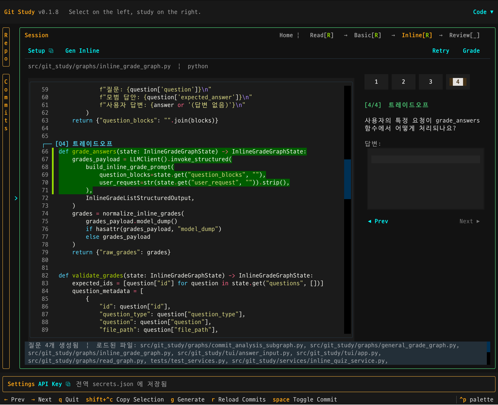

# git-study



`git-study`는 Git 커밋을 읽어 코드 변경의 의도와 흐름을 퀴즈로 바꿔주는 터미널 학습 도구입니다.

로컬 저장소와 GitHub 저장소를 분석해 인라인 퀴즈를 생성하고, 커밋을 읽고도 막상 왜 이렇게 바뀌었는지 설명하기 어려웠던 문제를 줄여줍니다.

## 이런 도구입니다

- 최근 커밋이나 선택한 커밋 범위를 읽고 인라인 퀴즈를 생성하고 채점합니다.
- 단순 diff만 보지 않고 변경 파일의 전체 코드 문맥도 함께 사용합니다.
- Textual TUI에서 커밋 탐색, 코드 브라우저, 인라인 퀴즈를 제공합니다.
- Streamlit 웹 앱에서 커밋 컨텍스트를 기반으로 자유롭게 질문할 수 있습니다.
- OpenAI API Key는 환경변수 또는 앱 내부 설정으로 넣을 수 있습니다.

## 설치

### 요구 사항

- Python `3.13+`
- `uv`
- OpenAI API 키

### TestPyPI에서 설치

```bash
UV_CACHE_DIR=/tmp/uv-cache uv tool install --refresh \
  --index-url https://test.pypi.org/simple/ \
  --extra-index-url https://pypi.org/simple/ \
  git-study==0.1.9
```

설치 후 실행:

```bash
git-study-v2          # TUI v2 (현재 버전)
git-study-streamlit   # Streamlit 웹 앱
git-study             # TUI v1 (레거시)
```

### 로컬 개발 환경에서 실행

```bash
UV_CACHE_DIR=/tmp/uv-cache uv sync
UV_CACHE_DIR=/tmp/uv-cache uv run git-study-v2
```

## 테스트

```bash
UV_CACHE_DIR=/tmp/uv-cache uv sync
UV_CACHE_DIR=/tmp/uv-cache uv run pytest tests
```

현재 테스트는 다음 영역을 우선 검증합니다.

- LLM 응답 normalization/schema 처리
- 인라인 앵커 파싱과 snippet 검증
- graph fallback/finalize 로직
- service 계층의 graph 호출 계약

## API Key 설정

다음 두 방식 중 하나를 사용할 수 있습니다.

### 환경변수

`.env` 파일이나 셸 환경에 설정할 수 있습니다.

```bash
OPENAI_API_KEY=...
```

### 앱 내부 설정

TUI 하단의 `Settings > API Key`에서 설정할 수 있습니다.

- `Session Only`: 현재 실행 동안만 메모리에 보관
- `Global File`: `~/.git-study/secrets.json`에 저장

설정 메타데이터는 `~/.git-study/settings.json`에 저장됩니다.

## TUI v2 사용 흐름

1. `git-study-v2`를 실행합니다.
2. 저장소 선택 화면에서 로컬 경로 또는 GitHub URL을 입력합니다.
3. `/commits`로 커밋 목록을 열고, Space로 시작/끝 커밋을 선택한 뒤 Enter로 확인합니다.
4. `/quiz` 또는 `/quiz HEAD~3`으로 인라인 퀴즈를 생성합니다.
5. 퀴즈 블록을 클릭하거나 `/answer`로 답변 모드에 진입해 Shift+Enter로 제출합니다.
6. `/grade`로 채점합니다.

### 명령어

| 명령어 | 설명 |
|--------|------|
| `/commits` | 커밋 목록 열기 |
| `/quiz` | 현재 범위로 퀴즈 생성 |
| `/quiz HEAD` | HEAD 커밋 1개 퀴즈 |
| `/quiz HEAD~3` | HEAD~3..HEAD (4개 커밋) 퀴즈 |
| `/quiz A..B` | A~B 범위 퀴즈 |
| `/grade` | 채점 실행 |
| `/answer` | 마지막 활성 질문으로 답변 모드 재진입 |
| `/help` | 도움말 |

### 키 조작

- **Up/Down**: 명령 히스토리 탐색
- **Shift+Enter**: 답변 제출
- **ESC** (answer 모드): 커맨드 모드로 전환
- **Ctrl+C**: 종료

## Streamlit 웹 앱

```bash
git-study-streamlit
```

사이드바에서 저장소 경로와 커밋 범위를 선택하면 해당 커밋 컨텍스트를 기반으로 채팅할 수 있습니다.

## 주요 기능

### 인라인 퀴즈

- 변경 파일의 실제 코드 위치에 앵커된 질문을 생성합니다.
- 질문 유형은 `intent`, `behavior`, `tradeoff`, `vulnerability`를 고르게 사용합니다.
- 파일 트리에서 퀴즈 진행 상태(`●` 미답변 / `✔` 완료 / `★` 채점)를 확인할 수 있습니다.
- Overview Ruler(오른쪽 세로 바)로 변경/퀴즈 위치를 한눈에 파악하고 클릭으로 이동합니다.

### 코드 브라우저

- 선택한 커밋 또는 커밋 범위의 전체 파일과 diff를 함께 볼 수 있습니다.
- 추가 라인=초록 배경, 삭제 라인=빨강 배경으로 표시됩니다.

### GitHub 저장소 지원

- `https://github.com/owner/repo` 형식 URL로 원격 저장소를 분석할 수 있습니다.
- 클론 캐시는 사용자 캐시 디렉터리에 저장됩니다.

기본 캐시 위치:

- macOS: `~/Library/Caches/git-study/github/`
- Linux: `$XDG_CACHE_HOME/git-study/github/` 또는 `~/.cache/git-study/github/`
- Windows: `%LOCALAPPDATA%/git-study/Cache/github/`

## 저장 위치

- 로컬 Git 저장소 실행: `<repo-root>/.git-study/`
- GitHub 원격 저장소 또는 일반 실행: `~/.git-study/`
- 앱 상태: `<storage-root>/state.json`
- 세션: `<storage-root>/sessions/{session_id}.json`
- 전역 설정: `~/.git-study/settings.json`
- 전역 비밀값: `~/.git-study/secrets.json`

## Graphs

이 프로젝트의 LangGraph는 고정된 노드와 review 단계의 조건 분기를 조합한 형태입니다.

### 공통 분석 subgraph

- `commit_analysis_subgraph_v1`: `resolve_commit_context → analyze_change`
  - Read/Basic 생성이 공통으로 쓰는 커밋 분석 subgraph

### 읽을거리 생성 graph

- `commit_diff_reading_v1`: `resolve_commit_context → analyze_change → draft_reading → review_reading → (repair_reading | finalize_reading)`

### 일반 퀴즈 생성 graph

- `commit_diff_quiz_v2`: `resolve_commit_context → analyze_change → draft_quiz → review_quiz → (repair_quiz | finalize_quiz)`

### 인라인 퀴즈 생성 graph

- `inline_quiz_questions_v2`: `prepare_inline_context → extract_anchor_candidates → validate_anchor_candidates → generate_inline_questions → review_inline_questions → (repair | finalize)`
  - 실제 파일 내용과 snippet을 대조해 앵커를 검증합니다.

### 채점 graph

- `general_quiz_grading_v1`, `inline_quiz_grading_v2`: `prepare_grading_payload → grade_answers → validate_grades → finalize_grades`

### `get_neighbor_code_context` tool

- 위치: `src/git_study/tools/code_context.py`
- `file_path`와 `anchor_snippet`을 받아 주변 코드 문맥을 반환합니다.
- 인라인 퀴즈 질문 생성/repair 시 사용됩니다.
