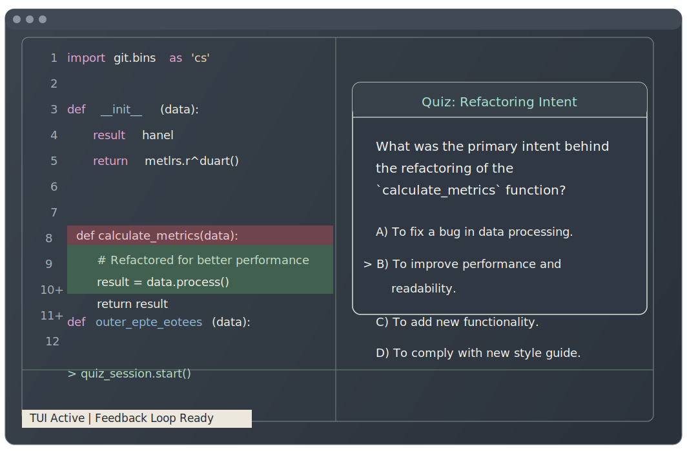

# git-study



`git-study`는 Git 커밋을 읽어 코드 변경의 의도와 흐름을 퀴즈로 바꿔주는 터미널 학습 도구입니다.

로컬 저장소와 GitHub 저장소를 분석해 일반 퀴즈와 인라인 퀴즈를 생성하고, 커밋을 읽고도 막상 왜 이렇게 바뀌었는지 설명하기 어려웠던 문제를 줄여줍니다.

## 이런 도구입니다

- 최근 커밋이나 선택한 커밋 범위를 읽고 학습용 퀴즈를 생성하고 채점합니다.
- 단순 diff만 보지 않고 변경 파일의 전체 코드 문맥도 함께 사용합니다.
- Textual TUI에서 커밋 탐색, 결과 저장/불러오기, 코드 브라우저, 인라인 퀴즈를 제공합니다.
- OpenAI API Key는 환경변수 또는 앱 내부 설정으로 넣을 수 있습니다.

## 설치

### 1. 요구 사항

- Python `3.13+`
- `uv`
- OpenAI API 키

### 2. TestPyPI에서 설치

테스트 배포본을 설치할 때는 `--refresh`와 버전 고정을 함께 쓰는 편이 안전합니다.

```bash
UV_CACHE_DIR=/tmp/uv-cache uv tool install --refresh --index-url https://test.pypi.org/simple/ --extra-index-url https://pypi.org/simple/ git-study==0.1.7
```

설치 후 실행:

```bash
git-study
```

### 3. 로컬 개발 환경에서 실행

의존성 설치:

```bash
UV_CACHE_DIR=/tmp/uv-cache uv sync --dev
```

TUI 실행:

```bash
UV_CACHE_DIR=/tmp/uv-cache uv run git-study
```

또는:

```bash
UV_CACHE_DIR=/tmp/uv-cache uv run python -m git_study.tui
```

## 테스트

개발 의존성까지 설치한 뒤 테스트를 실행할 수 있습니다.

```bash
UV_CACHE_DIR=/tmp/uv-cache uv sync --dev
UV_CACHE_DIR=/tmp/uv-cache uv run pytest tests
```

현재 테스트는 다음 영역을 우선 검증합니다.

- LLM 응답 normalization/schema 처리
- 인라인 앵커 파싱과 snippet 검증
- graph fallback/finalize 로직
- service 계층의 graph 호출 계약

## API Key 설정

다음 두 방식 중 하나를 사용할 수 있습니다.

### 환경변수

`.env` 파일이나 셸 환경에 설정할 수 있습니다.

```bash
OPENAI_API_KEY=...
```

### 앱 내부 설정

앱 하단의 `Settings > API Key`에서 설정할 수 있습니다.

- `Session Only`: 현재 실행 동안만 메모리에 보관
- `Global File`: `~/.git-study/secrets.json`에 저장

설정 메타데이터는 `~/.git-study/settings.json`에 저장됩니다.

## 빠른 사용 흐름

1. `git-study`를 실행합니다.
2. `Local` 또는 `GitHub`를 선택합니다.
3. 커밋을 고릅니다.
4. `Session`의 `Gen`으로 `Read`, `Quiz`, `Inline` 흐름을 시작합니다.
5. 각 탭에서 일반 퀴즈와 인라인 퀴즈를 풀고 채점합니다.
6. 필요하면 `Code`로 코드 브라우저를 열어 변경 내용을 함께 봅니다.

## 주요 기능

### 일반 퀴즈

- `auto`, `latest`, `selected` 커밋 모드를 지원합니다.
- 난이도: `Easy`, `Medium`, `Hard`
- 스타일: `Mixed`, `Study Session`, `Multiple Choice`, `Short Answer`, `Conceptual`
- 세션 안에서 답변을 저장하고 채점할 수 있습니다.

### 인라인 퀴즈

- 변경 파일의 실제 코드 위치에 앵커된 질문을 생성합니다.
- 질문 유형은 `intent`, `behavior`, `tradeoff`, `vulnerability`를 고르게 사용합니다.
- 답안을 입력하고 바로 채점할 수 있습니다.

### 코드 브라우저

- 선택한 커밋 또는 커밋 범위의 코드와 diff를 함께 볼 수 있습니다.

### GitHub 저장소 지원

- `https://github.com/owner/repo` 형식 URL을 입력해 원격 저장소를 분석할 수 있습니다.
- 원격 저장소 캐시는 사용자 캐시 디렉터리에 저장됩니다.
- `Caches` 버튼으로 현재 캐시를 확인하고 제거할 수 있습니다.

기본 캐시 위치:

- macOS: `~/Library/Caches/git-study/github/`
- Linux: `$XDG_CACHE_HOME/git-study/github/` 또는 `~/.cache/git-study/github/`
- Windows: `%LOCALAPPDATA%/git-study/Cache/github/` 또는 `~/AppData/Local/git-study/Cache/github/`

## 저장 위치

- 로컬 Git 저장소 실행: `<repo-root>/.git-study/`
- GitHub 원격 저장소 또는 일반 실행: `~/.git-study/`
- 앱 상태: `<storage-root>/state.json`
- 전역 설정: `~/.git-study/settings.json`
- 전역 비밀값: `~/.git-study/secrets.json`
- 퀴즈 결과: `<storage-root>/outputs/quiz-output-*`

## 키 조작

- `Tab` / `Shift+Tab`: 섹션 간 포커스 이동
- `Space`: 버튼 실행, 범위 선택, `Load More`, `Load All`
- `g`: 퀴즈 생성
- `r`: 커밋 목록 새로고침
- `q`: 종료
- `Ctrl+C`: 짧은 시간 안에 두 번 눌러 종료
- 인라인 퀴즈 화면: `Esc`, `Left/Right`, `h/l`

## 개발 메모

LangGraph 개발 서버 실행:

```bash
UV_CACHE_DIR=/tmp/uv-cache uv run langgraph dev
```

현재 주요 graph는 다음과 같습니다.

- `commit_diff_reading_v1`: 읽을거리 생성
- `commit_diff_quiz_v2`: 일반 퀴즈 생성
- `general_quiz_grading_v1`: 일반 퀴즈 채점
- `inline_quiz_questions_v2`: 인라인 퀴즈 질문 생성
- `inline_quiz_grading_v2`: 인라인 퀴즈 채점

실제 구조는 `domain/`, `graphs/`, `prompts/`, `services/`, `llm/`, `types.py`로 나뉘어 있습니다.

- `domain/`: 저장소 접근, 캐시, diff/file context 같은 순수 로직
- `graphs/`: LangGraph orchestration
- `services/`: TUI가 호출하는 진입점
- `llm/schemas.py`: LLM JSON 응답 normalization
- `types.py`: 공용 TypedDict

`src/git_study/graph.py`는 현재 레거시 호환용 안내 모듈로만 유지합니다.

공통 normalization/schema 로직은 `src/git_study/llm/schemas.py`에 있습니다.

핵심 파일:

- `src/git_study/domain/repo_context.py`
- `src/git_study/domain/repo_cache.py`
- `src/git_study/domain/code_context.py`
- `src/git_study/graphs/quiz_graph.py`
- `src/git_study/graphs/read_graph.py`
- `src/git_study/graphs/inline_quiz_graph.py`
- `src/git_study/graphs/general_grade_graph.py`
- `src/git_study/graphs/inline_grade_graph.py`
- `src/git_study/llm/schemas.py`
- `src/git_study/types.py`
- `src/git_study/services/quiz_service.py`
- `src/git_study/services/general_grade_service.py`
- `src/git_study/services/read_service.py`
- `src/git_study/services/inline_quiz_service.py`
- `src/git_study/services/inline_grade_service.py`
- `tests/test_schemas.py`
- `tests/test_inline_anchor.py`
- `tests/test_graph_fallbacks.py`
- `tests/test_services.py`
- `src/git_study/tui/app.py`
- `src/git_study/tui/inline_quiz.py`
- `src/git_study/tui/code_browser.py`
- `src/git_study/tui/state.py`
